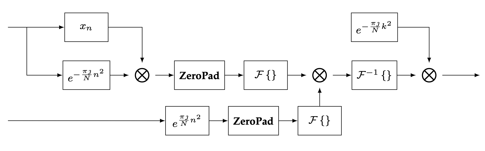
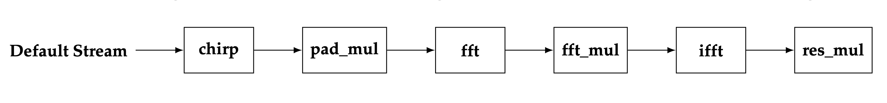
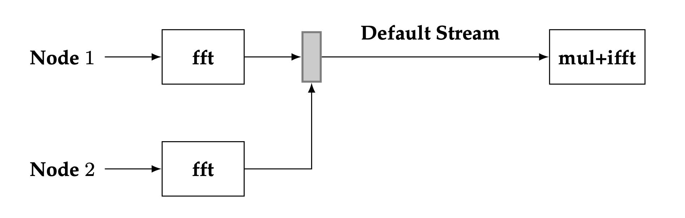
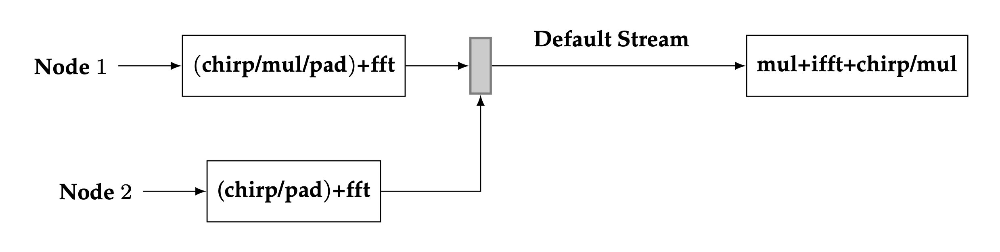

Bluestein Design Document
=========================

Copyright and Disclaimer
------------------------

DISCLAIMER

The information contained herein is for informational purposes only, and is subject to change without notice. While every precaution has been taken in the preparation of this document, it may contain technical inaccuracies, omissions and typographical errors, and AMD is under no obligation to update or otherwise correct this information. Advanced Micro Devices, Inc. makes no representations or warranties with respect to the accuracy or completeness of the contents of this document, and assumes no liability of any kind, including the implied warranties of noninfringement, merchantability or fitness for particular purposes, with respect to the operation or use of AMD hardware, software or other products described herein.  No license, including implied or arising by estoppel, to any intellectual property rights is granted by this document.  Terms and limitations applicable
to the purchase or use of AMD’s products are as set forth in a signed agreement between the parties or in AMD's Standard Terms and
Conditions of Sale.

AMD is a trademark of Advanced Micro Devices, Inc.  Other product names used in this publication are for identification purposes only and may be trademarks of their respective companies.

Copyright (c) 2023 Advanced Micro Devices, Inc. All rights reserved.

Summary
-------

This document revisits the Bluestein algorithm for prime-length discrete Fourier transforms (DFTs), and presents its implementation in the rocFFT library. An optimization of the Bluestein algorithm for large length DFTs is introduced. This optimization provide several benefits, including significantly improved performance and the ability to reuse the design to perform fast convolutions without any major design modifications.

Background and Notation
-----------------------
Let :math:`\mathbf{X} = \mathcal{F}\left\{ \mathbf{x} \right\}` denote the DFT of :math:`\mathbf{x}`, which maps an :math:`N`-length input sequence :math:`\mathbf{x} = \begin{bmatrix} x_0 &  \cdots & x_{N-1} \end{bmatrix}` into an :math:`N`-length output sequence :math:`\mathbf{X} = \begin{bmatrix} X_0 & \cdots & X_{N-1} \end{bmatrix}` with

.. math::

  X_k = \sum_{n=0}^{N-1}{x_n e^{-\frac{2 \pi \jmath}{N}nk}}, \qquad k = 0, \ \ldots, \ N-1.

Conversely, let :math:`\mathbf{x} = \mathcal{F}^{-1}\left\{ \mathbf{X} \right\}` denote the inverse DFT, which maps the sequence :math:`\mathbf{X}` into sequence :math:`\mathbf{x}` as follows

.. math::

   x_k = \frac{1}{N}\sum_{n=0}^{N-1}{X_n e^{\frac{2 \pi \jmath}{N}nk}}, \qquad k = 0, \ \ldots, \ N-1.

Bluestein Algorithm
-------------------
In Bluestein's algorithm, the following identity is considered for the DFT computation

.. math::

   nk = \frac{-(k-n)^2}{2} + \frac{n^2}{2} + \frac{k^2}{2}.

For example, substituting this identity into the DFT equation, the DFT can then be expressed as

.. math::

   X_k = e^{-\frac{\pi \jmath}{N}k^2} \sum_{n=0}^{N-1}{\left( x_n e^{-\frac{\pi \jmath}{N}n^2} \right) e^{\frac{\pi \jmath}{N}  (k-n)^2}{}}, \qquad k = 0, \ \ldots, \ N-1.

+++++
Chirp
+++++
Bluestein's algorithm is frequently used to compute the DFT, but it can also be used to compute the more general z-transform. This transform is similar to the DFT equation with the difference that the term :math:`e^{-\frac{2\pi \jmath}{N}}` is replaced by :math:`z`, where :math:`z` is an arbitrary complex number. 

Let :math:`\mathbf{c} = \begin{bmatrix} c_0 & \cdots & c_{N-1} \end{bmatrix}` denote an :math:`N` length sequence of the form

.. math::

   c_n = e^{\frac{\pi \jmath}{N}n^2}, \qquad n = 0, \ \ldots, \ N-1.

The sequence :math:`\mathbf{c}`, which is present in Bluestein DFT equation, is also known as chirp because it defines a complex sinusoid of linearly increasing frequency. Bluestein's algorithm is also known as the chirp z-transform for this reason.

+++++++++++
Convolution
+++++++++++

Now let :math:`\left(\mathbf{a} \ast \mathbf{b}\right)_k` for :math:`k = 0, \ \ldots, \ M-1` denote the convolution of two :math:`M`-length input sequences :math:`\mathbf{a} = \begin{bmatrix} a_0 & \cdots a_{M-1} \end{bmatrix}` and :math:`\mathbf{b} = \begin{bmatrix} b_0 & \cdots b_{M-1} \end{bmatrix}` with

.. math::

   \left(\mathbf{a} \ast \mathbf{b} \right)_k = \sum_{m=0}^{M-1}a_m b_{k-m}, \qquad k = 0, \ \ldots, \ M-1.

The DFT in the Bluestein DFT equation can be expressed in terms of the convolution sum in the above equation as

.. math::

   X_k = b_k^{-1} \sum_{m=0}^{M-1}{a_m b_{k-m}}, \qquad k = 0, \ \ldots, \ M-1,

with :math:`M=N`, :math:`a_m = x_m / c_m`, and :math:`b_m = c_m` for :math:`m = 0, \ \ldots, \ M-1`.

From the convolution theorem we know that, under suitable conditions, the convolution sum in convolution definition equation can be evaluated by computing the point-wise product of the DFTs of :math:`\mathbf{a}` and :math:`\mathbf{b}` and taking the inverse DFT of the product

.. math::

   \left(\mathbf{a} \ast \mathbf{b} \right) = \mathcal{F}^{-1}\left\{ \mathcal{F}\left\{ \mathbf{a} \right\} \cdot \mathcal{F}\left\{ \mathbf{b} \right\} \right\}. 

Note, however, that Bluestein's DFT equation in terms of the convolution sum cannot be used to directly evaluate the DFT equation under the values of :math:`M`, :math:`a_m` and :math:`b_m` provided.

++++++++++++
Zero padding
++++++++++++
Consider instead that the DFT in the Bluestein DFT convolution equation is evaluated with

.. math::

   M \geq 2N-1

and the sequences :math:`\mathbf{a}` and :math:`\mathbf{b}` are zero-padded as follows

.. math::

   a_m = \begin{cases} x_n / c_n& \text{for $n = 0, \ \ldots, \ N-1$},\\ 0 & \text{otherwise} \end{cases} 

and

.. math::

   b_m = \begin{cases} c_n& \qquad \text{for $n = 0, \ \ldots, \ N-1$ \ and $n = M - N + 1, \ \ldots, \ M - 1$},\\ 0 & \qquad \text{otherwise.} \end{cases}

In Bluestein's algorithm, the above conditions ensure that the convolution theorem holds and, therefore, the Bluestein's DFT equation can be properly employed for the DFT computation.

+++++++++++++++++
DFT via Bluestein
+++++++++++++++++

Based on the two conditions for the sequences :math:`\mathbf{a}` and :math:`\mathbf{b}` obtained above, and the convolution theorem, the DFT can be computed as follows in Bluestein's algorithm

.. math::

   X_k = b_k^{-1} \mathcal{F}^{-1}\left\{ \mathcal{F}\left\{ \mathbf{a} \right\} \cdot \mathcal{F}\left\{ \mathbf{b} \right\} \right\}, \qquad k = 0, \ \ldots, \ N-1.

There are quite a few operations involved in this computation. More specifically, computation of the chirp sequence, two :math:`N`-length plus one :math:`M`-length point-wise multiplications, zero-padding of two :math:`M`-length sequences, and two forward DFTs of length :math:`M` plus an inverse DFT also of length :math:`M`. 

The main reason for using Bluestein's algorithm is that it applies for the DFT computation of any input length :math:`N`, including prime lengths. When a fast Fourier transform (FFT) algorithm is used to compute the DFT, such as Stockham or Cooley-Tukey, it provides optimized length support via a given radix or combination of radices, e.g., :math:`N = 2, \ 3, \ 5, \ 25 \times 2, \ 16 \times 9`, and so on. Considering that the DFTs via Bluestein can be carried out with any length satisfying :math:`M \geq 2N-1`, a suitably chosen value of :math:`M` can be used to compute the  convolution via an FFT with existing radix support. However, it should be mentioned that the Bluestein DFT computation is much slower than directly computing the DFT equation via an FFT with a supported length, even though both computations posses the same complexity of :math:`O(N \log N)`.

Implementation
--------------

An illustration of the steps required for Bluestein's algorithm is given in the figure below.

   Diagram of computations involved in Bluestein's algorithm

A few observations can be made from the block diagram.  First, it can be seen that there are no direct dependencies between the two branches that compute :math:`\mathcal{F}\left\{ \mathbf{a} \right\}` and :math:`\mathcal{F}\left\{ \mathbf{b} \right\}` and, therefore, parallelization may be leveraged to speed-up the computations and perform the two sequence of operations independently. Second, it can further be seen that the chirp sequence is used multiple times throughout the diagram. Re-utilizing the computed chirp sequence across the operations where possible may also be advantageous. Third, there are quite a few number of operations in the diagram, and it is, therefore, often preferable to put together these operations into as little as possible device kernels, due to the overhead of kernel launch.

+++++++++++++++++++++++++++
Device Kernel Configuration
+++++++++++++++++++++++++++

Important factors to consider when designing an efficient implementation of Bluestein's algorithm are (1) the length of the DFT to be performed, (2) the size of available shared memory for the compute device at hand, and (3) the latency for launching device kernels. For instance, when the DFT length is small, all the operations in Bluestein's algorithm may be performed in a single device kernel, if data can fit into shared memory. This minimizes kernel launching overhead and provides the best performance.

In the case where the DFT length is large and the entire data does not fit into shared memory, a hierarchical approach is utilized where the large FFT is decomposed into smaller FFT device kernels that fit into shared memory for improved performance. In this large length DFT scenario, it is important to minimize the number of device kernels utilized in the implementation for reduced kernel launch overhead. 

The default implementation for Bluestein's algorithm when applied to large length DFTs is illustrated in the diagram below.

   Default device kernel configuration for Bluestein's algorithm and large length DFTs

As can be seen from the diagram, Bluestein's algorithm is performed with (at least) six kernels in a single device stream. The chirp sequence is computed in a single chirp kernel, and the sequence is re-utilized at later stages via a temporary device buffer. The two forward DFTs are joined together in one fft device node. This is possible because the padded sequences :math:`\mathbf{a}` and :math:`\mathbf{b}` are contiguous in the temporary device buffer used in the implementation, thus allowing for a single fft node to perform the two fft operations. The inverse FFT operation requires a separate ifft device node. Similarly, the three point-wise multiplications are carried out with separate kernels, pad\_mul, fft\_mul, and res\_mul. 

Note that the fft (or ifft) nodes are usually split into at least two device kernels for large length DFTs. For example, a large 1D input data vector is viewed as a matrix (with same number of elements as the large vector), and the first FFT device kernel operates on rows of the data matrix while the second device kernel operates on the columns of the data matrix. In this scenario, a total of 8 device kernels are used to perform Bluestein's algorithm.

++++++++++++++++++++++++++++++++++++++++++
Optimizing Bluestein for large length DFTs
++++++++++++++++++++++++++++++++++++++++++

The default implementation of Bluestein's algorithm for large length DFTs can be optimized by following the design principles:

#. Use the convolution as a building block for the implementation.
#. Minimize the number of device kernels by fusing FFT read and write operations with Bluestein operations.
#. Move computation of the chirp sequence from the FFT execution phase to the plan creation phase in rocFFT.

The convolution building block is shown in the diagram below.

   Proposed configuration of device kernels for fast convolution

In the building block, two independent FFT device nodes are used to carry out the forward DFTs. The point-wise multiplication of the two forward DFTs is fused with the read operation of the iFFT device node. Arranging the convolution in this configuration has two advantages. The independence of the two forward FFT nodes means that parallelism may be leveraged, since the two foward FFT nodes may be executed concurrently if required. Fusing the point-wise multiplication of the two foward DFTs means that a separate kernel for performing the point-wise multiplication is no longer required, thus reducing device kernel launch latency.

A typical use case of the rocFFT library is to create an FFT plan device handle once, and perform FFTs on multiple input data using this same plan handle. As shown in the diagram of Bluestein's algorithm, the chirp sequence :math:`\mathbf{c}` is independent from the input sequence :math:`\mathbf{x}`. Since the execution phase of rocFFT depends only on the input sequence, it is advantageous to precompute :math:`\mathbf{c}` at the plan creation phase of the library. That way, it is not always required to compute :math:`\mathbf{c}` when an FFT is executed, thus reducing the overal amount of computations.

Based upon the three design principles above, an optimized implementation of Bluestein's algorithm is described in the diagram below.

   Proposed configuration of device kernels for Bluestein's algorithm

As can be seen from the diagram, the implementation of Bluestein's algorithm is quite similar to the fast convolution implementation. The main difference between the two implementations is that the foward/inverse DFT stages have additional fused operations in them. Compared to the default Bluestein implementation, at least three device nodes are used in the optimization. When using the row/column FFT decomposition for large lengths, this brings to a total of 6 device kernels in the optimization, a significant redution in the number of kernels compared to the default configuration.

The read operation of the first DFT stage is fused with chirp + point-wise multiplication + padding. The read operation of the second DFT stage is fused with the chirp + padding. Similarly, the point-wise multiplication of the two forward DFTs is fused with the read operation of the inverse DFT node, and the chirp + point-wise multiplication is fused with its write operation. Since the chirp sequence is computed at the plan level, the chirp operations are performed by simply loading the computed chirp table into device registers. 

Parallelization of the first two FFT nodes can be employed in the optimized implementation, however, preliminary tests have shown that in practice not much performance is gained by executing the two nodes simultaneously. The main reason for this is due to the fact that a synchronization step is required after the two forward DFT stages. This is denoted by the thin solid rectangle in the diagram. Another factor that needs to be taken into account is that in practice the amount of computation performed on the second FFT node is usually much smaller than the first FFT node. A typical use case of the rocFFT library is to perform batched FFTs. In this scenario, the amount of computation in the two forward FFT nodes is unbalanced since multiple FFTs are performed on the first node while only a single FFT is performed on the second node. This unbalance between the independent nodes makes the benefits of parallelization less pronounced.

One last technical aspect of the optimization is the need to have separate transform and contiguous data indices across the multiple FFT nodes. Since the FFT nodes decompose a large length FFT into a column and a row FFT, the device kernels need to keep track of a global transform index to properly perform the fused read/write Bluestein operations. A similar concept is required for the data index, as the temporary buffers utilized for the computations are accessed in a contiguous fashion for minimal storage requirements.

